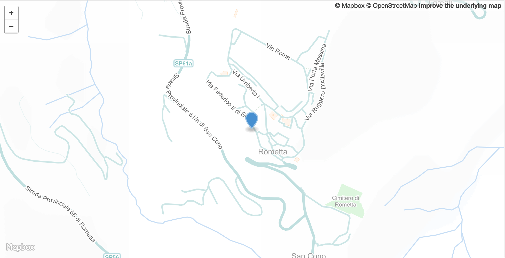

<!--
%\VignetteEngine{knitr::rmarkdown}
%\VignetteIndexEntry{pleiades introduction}
%\VignetteEncoding{UTF-8}
-->


pleiades introduction
=====================

R client for [Pleiades](https://pleiades.stoa.org/home)

+ Homepage <https://pleiades.stoa.org/home>
+ API docs <http://api.pleiades.stoa.org/>

## Install

More stable CRAN version


```r
install.packages("pleiades")
```

Dev version


```r
remotes::install_github("ropensci/pleiades")
```


```r
library("pleiades")
```

## Status


```r
pl_status()
#> $num_places
#> [1] 37283
#> 
#> $num_locations
#> [1] 40274
#> 
#> $num_names
#> [1] 33346
```

## Places

`pl_places` uses the Pleiades API. Just a subst of output for brevity


```r
pl_places(place_id = 579885)[1:2]
#> $features
#> list()
#> 
#> $contributors
#> $contributors[[1]]
#> $contributors[[1]]$username
#> [1] "bkiesling"
#> 
#> $contributors[[1]]$homepage
#> NULL
#> 
#> $contributors[[1]]$name
#> [1] "Brady Kiesling"
#> 
#> $contributors[[1]]$uri
#> [1] "https://pleiades.stoa.org/author/bkiesling"
#> 
#> 
#> $contributors[[2]]
#> $contributors[[2]]$username
#> [1] "sgillies"
#> 
#> $contributors[[2]]$homepage
#> NULL
#> 
#> $contributors[[2]]$name
#> [1] "Sean Gillies"
#> 
#> $contributors[[2]]$uri
#> [1] "https://pleiades.stoa.org/author/sgillies"
#> 
#> 
#> $contributors[[3]]
#> $contributors[[3]]$username
#> NULL
#> 
#> $contributors[[3]]$name
#> [1] "Chelsea Lee"
#> 
#> 
#> $contributors[[4]]
#> $contributors[[4]]$username
#> [1] "jbecker"
#> 
#> $contributors[[4]]$homepage
#> NULL
#> 
#> $contributors[[4]]$name
#> [1] "Jeffrey Becker"
#> 
#> $contributors[[4]]$uri
#> [1] "https://pleiades.stoa.org/author/jbecker"
#> 
#> 
#> $contributors[[5]]
#> $contributors[[5]]$username
#> [1] "rbrowning"
#> 
#> $contributors[[5]]$homepage
#> NULL
#> 
#> $contributors[[5]]$name
#> [1] "Rachaelle L Browning"
#> 
#> $contributors[[5]]$uri
#> [1] "https://pleiades.stoa.org/author/rbrowning"
#> 
#> 
#> $contributors[[6]]
#> $contributors[[6]]$username
#> NULL
#> 
#> $contributors[[6]]$name
#> [1] "DARMC"
#> 
#> 
#> $contributors[[7]]
#> $contributors[[7]]$username
#> NULL
#> 
#> $contributors[[7]]$name
#> [1] "R. Talbert"
#> 
#> 
#> $contributors[[8]]
#> $contributors[[8]]$username
#> [1] "jahlfeldt"
#> 
#> $contributors[[8]]$homepage
#> NULL
#> 
#> $contributors[[8]]$name
#> [1] "Johan Åhlfeldt"
#> 
#> $contributors[[8]]$uri
#> [1] "https://pleiades.stoa.org/author/jahlfeldt"
#> 
#> 
#> $contributors[[9]]
#> $contributors[[9]]$username
#> [1] "alecpm"
#> 
#> $contributors[[9]]$homepage
#> NULL
#> 
#> $contributors[[9]]$name
#> [1] "Alec Mitchell"
#> 
#> $contributors[[9]]$uri
#> [1] "https://pleiades.stoa.org/author/alecpm"
#> 
#> 
#> $contributors[[10]]
#> $contributors[[10]]$username
#> [1] "arabinowitz"
#> 
#> $contributors[[10]]$homepage
#> NULL
#> 
#> $contributors[[10]]$name
#> [1] "Adam Rabinowitz"
#> 
#> $contributors[[10]]$uri
#> [1] "https://pleiades.stoa.org/author/arabinowitz"
#> 
#> 
#> $contributors[[11]]
#> $contributors[[11]]$username
#> [1] "thomase"
#> 
#> $contributors[[11]]$homepage
#> NULL
#> 
#> $contributors[[11]]$name
#> [1] "Tom Elliott"
#> 
#> $contributors[[11]]$uri
#> [1] "https://pleiades.stoa.org/author/thomase"
#> 
#> 
#> $contributors[[12]]
#> $contributors[[12]]$username
#> [1] "pmotylewicz"
#> 
#> $contributors[[12]]$homepage
#> NULL
#> 
#> $contributors[[12]]$name
#> [1] "Pierre Motylewicz"
#> 
#> $contributors[[12]]$uri
#> [1] "https://pleiades.stoa.org/author/pmotylewicz"
#> 
#> 
#> $contributors[[13]]
#> $contributors[[13]]$username
#> NULL
#> 
#> $contributors[[13]]$name
#> [1] "April Kissinger"
#> 
#> 
#> $contributors[[14]]
#> $contributors[[14]]$username
#> NULL
#> 
#> $contributors[[14]]$name
#> [1] "Eric Shea"
#> 
#> 
#> $contributors[[15]]
#> $contributors[[15]]$username
#> [1] "rmhorne"
#> 
#> $contributors[[15]]$homepage
#> NULL
#> 
#> $contributors[[15]]$name
#> [1] "Ryan Horne"
#> 
#> $contributors[[15]]$uri
#> [1] "https://pleiades.stoa.org/author/rmhorne"
#> 
#> 
#> $contributors[[16]]
#> $contributors[[16]]$username
#> [1] "swright"
#> 
#> $contributors[[16]]$homepage
#> NULL
#> 
#> $contributors[[16]]$name
#> [1] "Sterling Wright"
#> 
#> $contributors[[16]]$uri
#> [1] "https://pleiades.stoa.org/author/swright"
```

## Search bulk files locally

Pleiades nicely provides their bulk data (for locations, names, and places) in various formats, including `.csv`. We've created three functions `pl_search_loc()`, `pl_search_names()`, and `pl_search_places()` to search each of those datasets. As these are relatively large (approx 40K rows by 30 columns), `dplyr` is a nice approach to dealing with big-ish data. At this time `dplyr` is a dependency. 

You can run `pl_cache()` first to get the raw data files from Pleiades


```r
pl_cache()
```

Or, that function is run internally in `pl_search*()` functions for you.

Search across all tables in one database, or separately locations, names, or places. You can return the data (that is, a `dplyr` representation of the data) if you don't pass anything to the function call:

Gives each table in a list


```r
pl_search()
#> [[1]]
#> # Source:   table<locations> [?? x 25]
#> # Database: sqlite 3.33.0
#> #   [/Users/sckott/Library/Caches/pleiades/pleiades_all.sqlite3]
#>    authors bbox  created creators currentVersion description featureType
#>    <chr>   <chr> <chr>   <chr>             <int> <chr>       <chr>      
#>  1 Becker… 13.4… 2013-0… jbecker               4 "The post-… settlement,
#>  2 Becker… 11.6… 2013-0… jbecker               3 "A major u… temple-2,  
#>  3 Spann,… -3.6… 2011-0… P.O. Sp…              1 "1M scale … unknown    
#>  4 Spann,… -2.0… 2010-0… P.O. Sp…              0 ""          unknown    
#>  5 Spann,… -2.4… 2011-0… P.O. Sp…              1 "1M scale … unknown    
#>  6 Spann,… 0.10… 2011-0… P.O. Sp…              1 "1:1 milli… unknown    
#>  7 Spann,… -3.9… 2011-0… P.O. Sp…              1 "1M scale … unknown    
#>  8 Spann,… 1.43… 2011-0… P.O. Sp…              1 "1M scale … unknown    
#>  9 Becker… 1.43… 2013-0… jbecker               1 "verified … island     
#> 10 Spann,… -3.3… 2011-0… P.O. Sp…              1 "1M scale … unknown    
#> # … with more rows, and 18 more variables: geometry <chr>, id <chr>,
#> #   locationPrecision <chr>, locationType <chr>, maxDate <int>, minDate <int>,
#> #   modified <chr>, path <chr>, pid <chr>, reprLat <dbl>, reprLatLong <chr>,
#> #   reprLong <dbl>, tags <chr>, timePeriods <chr>, timePeriodsKeys <chr>,
#> #   timePeriodsRange <chr>, title <chr>, uid <chr>
#> 
#> [[2]]
#> # Source:   table<names> [?? x 26]
#> # Database: sqlite 3.33.0
#> #   [/Users/sckott/Library/Caches/pleiades/pleiades_all.sqlite3]
#>    authors bbox  created creators currentVersion description extent id   
#>    <chr>   <chr> <chr>   <chr>             <int> <chr>       <chr>  <chr>
#>  1 Spann,… "-3.… 2010-0… P.O. Sp…             NA ""          "{\"t… cons…
#>  2 Spann,… "-3.… 2010-0… P.O. Sp…             NA ""          "{\"t… cons…
#>  3 Spann,… "-3.… 2010-0… P.O. Sp…             NA ""          "{\"t… kond…
#>  4 Becker… "-3.… 2016-0… jbecker               1 "An ethnic… "{\"t… cons…
#>  5 Spann,… "-2.… 2010-0… P.O. Sp…              1 ""          "{\"t… cont…
#>  6 Spann,… "-2.… 2010-0… P.O. Sp…             NA ""          "{\"t… cont…
#>  7 Spann,… "0.1… 2010-0… P.O. Sp…              0 ""          "{\"t… dian…
#>  8 Spann,… "0.1… 2010-0… P.O. Sp…              1 ""          "{\"t… heme…
#>  9 Becker… ""    2012-1… jbecker               1 ""          ""     denia
#> 10 Spann,… "-3.… 2010-0… P.O. Sp…             NA ""          "{\"t… ebura
#> # … with more rows, and 18 more variables: locationPrecision <chr>,
#> #   maxDate <int>, minDate <int>, modified <chr>, nameAttested <chr>,
#> #   nameLanguage <chr>, nameTransliterated <chr>, path <chr>, pid <chr>,
#> #   reprLat <dbl>, reprLatLong <chr>, reprLong <dbl>, tags <chr>,
#> #   timePeriods <chr>, timePeriodsKeys <chr>, timePeriodsRange <chr>,
#> #   title <chr>, uid <chr>
#> 
#> [[3]]
#> # Source:   table<places> [?? x 26]
#> # Database: sqlite 3.33.0
#> #   [/Users/sckott/Library/Caches/pleiades/pleiades_all.sqlite3]
#>    authors bbox  connectsWith created creators currentVersion description extent
#>    <chr>   <chr> <chr>        <chr>   <chr>             <int> <chr>       <chr> 
#>  1 Becker… 13.4… "413005"     2016-1… jbecker…              1 The post-R… "{\"t…
#>  2 Becker… 11.6… "413393"     2016-1… jbecker…              2 A major ur… "{\"t…
#>  3 Spann,… -3.6… ""           2010-0… P.O. Sp…             15 An ancient… "{\"t…
#>  4 Spann,… -0.5… ""           2010-0… P.O. Sp…              4 Contestani… "{\"t…
#>  5 Spann,… -2.4… ""           2010-0… P.O. Sp…              6 An ancient… "{\"t…
#>  6 Spann,… 0.10… "269561"     2018-0… P.O. Sp…              8 An ancient… "{\"t…
#>  7 Spann,… -3.9… ""           2010-0… P.O. Sp…              3 An ancient… "{\"t…
#>  8 Spann,… 1.43… "265884"     2010-0… P.O. Sp…              5 An ancient… "{\"t…
#>  9 Spann,… 1.43… "266001"     2010-0… P.O. Sp…              7 Ebusus Ins… "{\"t…
#> 10 Spann,… -3.3… ""           2010-0… P.O. Sp…              5 An ancient… "{\"t…
#> # … with more rows, and 18 more variables: featureTypes <chr>,
#> #   geoContext <chr>, hasConnectionsWith <chr>, id <dbl>,
#> #   locationPrecision <chr>, maxDate <int>, minDate <int>, modified <chr>,
#> #   path <chr>, reprLat <dbl>, reprLatLong <chr>, reprLong <dbl>, tags <chr>,
#> #   timePeriods <chr>, timePeriodsKeys <chr>, timePeriodsRange <chr>,
#> #   title <chr>, uid <chr>
```

Locations only


```r
pl_search_loc()
#> # Source:   table<locations> [?? x 25]
#> # Database: sqlite 3.33.0
#> #   [/Users/sckott/Library/Caches/pleiades/pleiades_locations.sqlite3]
#>    authors bbox  created creators currentVersion description featureType
#>    <chr>   <chr> <chr>   <chr>             <int> <chr>       <chr>      
#>  1 Becker… 13.4… 2013-0… jbecker               4 "The post-… settlement,
#>  2 Becker… 11.6… 2013-0… jbecker               3 "A major u… temple-2,  
#>  3 Spann,… -3.6… 2011-0… P.O. Sp…              1 "1M scale … unknown    
#>  4 Spann,… -2.0… 2010-0… P.O. Sp…              0 ""          unknown    
#>  5 Spann,… -2.4… 2011-0… P.O. Sp…              1 "1M scale … unknown    
#>  6 Spann,… 0.10… 2011-0… P.O. Sp…              1 "1:1 milli… unknown    
#>  7 Spann,… -3.9… 2011-0… P.O. Sp…              1 "1M scale … unknown    
#>  8 Spann,… 1.43… 2011-0… P.O. Sp…              1 "1M scale … unknown    
#>  9 Becker… 1.43… 2013-0… jbecker               1 "verified … island     
#> 10 Spann,… -3.3… 2011-0… P.O. Sp…              1 "1M scale … unknown    
#> # … with more rows, and 18 more variables: geometry <chr>, id <chr>,
#> #   locationPrecision <chr>, locationType <chr>, maxDate <int>, minDate <int>,
#> #   modified <chr>, path <chr>, pid <chr>, reprLat <dbl>, reprLatLong <chr>,
#> #   reprLong <dbl>, tags <chr>, timePeriods <chr>, timePeriodsKeys <chr>,
#> #   timePeriodsRange <chr>, title <chr>, uid <chr>
```

Or you can submit a query:


```r
pl_search_loc("SELECT * FROM locations limit 5")
#> # Source:   SQL [?? x 25]
#> # Database: sqlite 3.33.0
#> #   [/Users/sckott/Library/Caches/pleiades/pleiades_locations.sqlite3]
#>   authors bbox  created creators currentVersion description featureType geometry
#>   <chr>   <chr> <chr>   <chr>             <int> <chr>       <chr>       <chr>   
#> 1 Becker… 13.4… 2013-0… jbecker               4 "The post-… settlement, "{\"typ…
#> 2 Becker… 11.6… 2013-0… jbecker               3 "A major u… temple-2,   "{\"typ…
#> 3 Spann,… -3.6… 2011-0… P.O. Sp…              1 "1M scale … unknown     "{\"typ…
#> 4 Spann,… -2.0… 2010-0… P.O. Sp…              0 ""          unknown     "{\"typ…
#> 5 Spann,… -2.4… 2011-0… P.O. Sp…              1 "1M scale … unknown     "{\"typ…
#> # … with 17 more variables: id <chr>, locationPrecision <chr>,
#> #   locationType <chr>, maxDate <int>, minDate <int>, modified <chr>,
#> #   path <chr>, pid <chr>, reprLat <dbl>, reprLatLong <chr>, reprLong <dbl>,
#> #   tags <chr>, timePeriods <chr>, timePeriodsKeys <chr>,
#> #   timePeriodsRange <chr>, title <chr>, uid <chr>
```

Search names


```r
pl_search_names("SELECT * FROM names limit 5")
#> # Source:   SQL [?? x 26]
#> # Database: sqlite 3.33.0
#> #   [/Users/sckott/Library/Caches/pleiades/pleiades_names.sqlite3]
#>   authors bbox  created creators currentVersion description extent id   
#>   <chr>   <chr> <chr>   <chr>             <int> <chr>       <chr>  <chr>
#> 1 Spann,… -3.6… 2010-0… P.O. Sp…             NA ""          "{\"t… cons…
#> 2 Spann,… -3.6… 2010-0… P.O. Sp…             NA ""          "{\"t… cons…
#> 3 Spann,… -3.6… 2010-0… P.O. Sp…             NA ""          "{\"t… kond…
#> 4 Becker… -3.6… 2016-0… jbecker               1 "An ethnic… "{\"t… cons…
#> 5 Spann,… -2.0… 2010-0… P.O. Sp…              1 ""          "{\"t… cont…
#> # … with 18 more variables: locationPrecision <chr>, maxDate <int>,
#> #   minDate <int>, modified <chr>, nameAttested <chr>, nameLanguage <chr>,
#> #   nameTransliterated <chr>, path <chr>, pid <chr>, reprLat <dbl>,
#> #   reprLatLong <chr>, reprLong <dbl>, tags <chr>, timePeriods <chr>,
#> #   timePeriodsKeys <chr>, timePeriodsRange <chr>, title <chr>, uid <chr>
```

Search places


```r
pl_search_places("SELECT * FROM places limit 5")
#> # Source:   SQL [?? x 26]
#> # Database: sqlite 3.33.0
#> #   [/Users/sckott/Library/Caches/pleiades/pleiades_places.sqlite3]
#>   authors bbox  connectsWith created creators currentVersion description extent
#>   <chr>   <chr> <chr>        <chr>   <chr>             <int> <chr>       <chr> 
#> 1 Becker… 13.4… "413005"     2016-1… jbecker…              1 The post-R… "{\"t…
#> 2 Becker… 11.6… "413393"     2016-1… jbecker…              2 A major ur… "{\"t…
#> 3 Spann,… -3.6… ""           2010-0… P.O. Sp…             15 An ancient… "{\"t…
#> 4 Spann,… -0.5… ""           2010-0… P.O. Sp…              4 Contestani… "{\"t…
#> 5 Spann,… -2.4… ""           2010-0… P.O. Sp…              6 An ancient… "{\"t…
#> # … with 18 more variables: featureTypes <chr>, geoContext <chr>,
#> #   hasConnectionsWith <chr>, id <dbl>, locationPrecision <chr>, maxDate <int>,
#> #   minDate <int>, modified <chr>, path <chr>, reprLat <dbl>,
#> #   reprLatLong <chr>, reprLong <dbl>, tags <chr>, timePeriods <chr>,
#> #   timePeriodsKeys <chr>, timePeriodsRange <chr>, title <chr>, uid <chr>
```

## Create geojson map on Github Gists


```r
res <- pl_places(place_id = 462471)
pl_gist(res)
```

Which opens up the gist in your default browser, as long as `browse = TRUE` (default).


